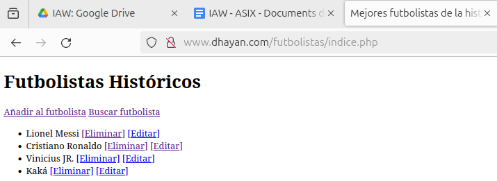
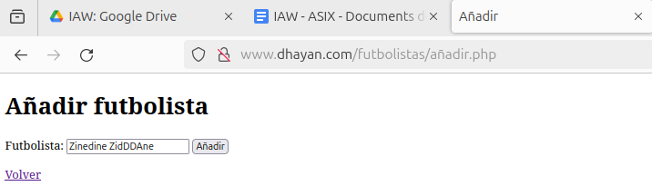
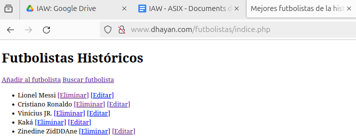
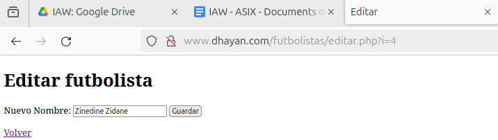
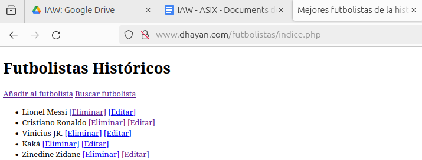
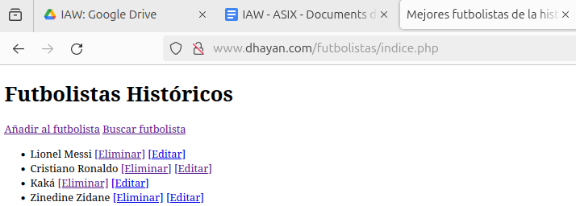
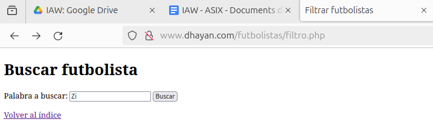
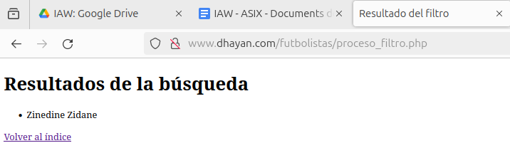

---

# Aplicación PHP: Gestión de futbolistas históricos con sesiones

La siguiente documentación explica paso a paso el funcionamiento de una pequeña aplicación web desarrollada en **PHP**, cuyo objetivo es **gestionar una lista de futbolistas históricos**.
La aplicación permite **añadir**, **listar**, **editar**, **eliminar** y **filtrar** futbolistas utilizando **sesiones PHP**, sin necesidad de base de datos.

---

## Entorno utilizado

* Ubuntu 24.04
* Servidor web con soporte PHP (Apache + PHP).
* Navegador web (en este caso, mozilla).
* Archivos PHP ubicados en el directorio del servidor web (por ejemplo `/var/www/html/futbolistas/`).

---

## Estructura de la aplicación

La aplicación está compuesta por los siguientes archivos:

* `indice.php` → Página principal, muestra la lista de futbolistas.
* `añadir.php` → Formulario para añadir un nuevo futbolista.
* `proceso_añadir.php` → Procesa el formulario de añadir.
* `eliminar.php` → Elimina un futbolista de la lista.
* `editar.php` → Formulario para editar un futbolista.
* `proceso_editar.php` → Procesa la edición.
* `filtro.php` → Formulario de búsqueda.
* `proceso_filtro.php` → Muestra los resultados del filtro.

Todos los datos se almacenan en la **sesión PHP** usando un array.

---

## Funcionamiento del índice (`indice.php`)

Este archivo es el **punto de entrada** de la aplicación.
Su función es mostrar la lista de futbolistas guardados en la sesión y ofrecer enlaces para añadir, editar o eliminar elementos.

### Inicio de sesión y carga de datos

```php
session_start();
```

Este comando inicia la sesión PHP.
Es imprescindible para poder acceder a `$_SESSION`.

```php
$lista = array();
if (isset($_SESSION["Lista_Jugadores"])) {
    $lista = $_SESSION["Lista_Jugadores"];
}
```

Aquí comprobamos si ya existe la lista de futbolistas en la sesión.
Si existe, la cargamos en la variable `$lista`.
Si no existe, trabajamos con un array vacío.

---

### Mostrar la lista de futbolistas

```php
for ($i = 0; $i < count($lista); $i++) {
    $jugador = $lista[$i];
    echo "<li>" . $jugador . " ";
    echo "<a href=\"eliminar.php?i=" . $i . "\">[Eliminar]</a> ";
    echo "<a href=\"editar.php?i=" . $i . "\">[Editar]</a>";
    echo "</li>";
}
```

* Se recorre el array con un `for`.
* Cada futbolista se muestra dentro de una etiqueta `<li>`.
* Se añaden enlaces para **eliminar** y **editar**, pasando el índice por `GET`.

---

## Añadir un futbolista (`añadir.php`)

Este archivo solo contiene un **formulario HTML**.

```html
<form action="proceso_añadir.php" method="post">
    <label>Futbolista:
        <input type="text" name="futbolista" required>
    </label>
    <button type="submit">Añadir</button>
</form>
```

* El formulario envía los datos por **POST**.
* El campo es obligatorio gracias a `required`.
* Al enviar, los datos se procesan en `proceso_añadir.php`.

---

## Procesar el añadido (`proceso_añadir.php`)

Este archivo se encarga de **recoger el dato**, **guardarlo en sesión** y **redirigir** al índice.

### Recogida y validación de datos

```php
session_start();

if (isset($_POST["futbolista"]) && $_POST["futbolista"] !== "") {
    $prod = trim($_POST["futbolista"]);
}
```

* Se comprueba que el campo exista y no esté vacío.
* `trim()` elimina espacios al inicio y al final.

---

### Inicializar la lista si no existe

```php
if (!isset($_SESSION["Lista_Jugadores"])) {
    $_SESSION["Lista_Jugadores"] = array();
}
```

Esto evita errores si es el primer futbolista que se añade.

---

### Añadir el futbolista y redirigir

```php
$_SESSION["Lista_Jugadores"][] = $prod;

header("Location: indice.php");
exit;
```

* El futbolista se añade al final del array.
* `header()` redirige al índice.
* `exit` asegura que el script se detenga.

---

## Eliminar un futbolista (`eliminar.php`)

Este archivo elimina un elemento del array usando su índice.

```php
$i = intval($_GET["i"]);
```

`intval()` convierte el valor a entero, evitando problemas de seguridad.

```php
unset($_SESSION["Lista_Jugadores"][$i]);
$_SESSION["Lista_Jugadores"] = array_values($_SESSION["Lista_Jugadores"]);
```

* `unset()` elimina el elemento.
* `array_values()` reorganiza los índices para evitar huecos.

Finalmente se vuelve al índice con una redirección.

---

## Editar un futbolista (`editar.php`)

Este archivo muestra un formulario **relleno con el nombre actual**.

```php
$valor = $_SESSION["Lista_Jugadores"][$i];
```

El valor actual se inserta en el input:

```html
<input type="text" name="jugador" value="<?php echo $valor; ?>" required>
```

También se envía el índice oculto:

```html
<input type="hidden" name="i" value="<?php echo $i; ?>">
```

---

## Procesar la edición (`proceso_editar.php`)

```php
$i = intval($_POST["i"]);
$nuevo = trim($_POST["jugador"]);
```

Se recogen el índice y el nuevo nombre.

```php
$_SESSION["Lista_Jugadores"][$i] = $nuevo;
```

Se sustituye el valor antiguo por el nuevo y se redirige al índice.

---

## Filtrar futbolistas (`filtro.php`)

Este archivo muestra un formulario para introducir una palabra clave:

```html
<form action="proceso_filtro.php" method="post">
    <input type="text" name="cadena" required>
    <button type="submit">Buscar</button>
</form>
```

---

## Procesar el filtro (`proceso_filtro.php`)

Se recupera la cadena y la lista:

```php
$cadena = trim($_POST["cadena"]);
$lista = $_SESSION["Lista_Jugadores"];
```

Se recorren los futbolistas y se comparan:

```php
if (str_contains(strtolower($lista[$i]), strtolower($cadena))) {
    echo "<li>" . $lista[$i] . "</li>";
}
```

* `str_contains()` comprueba si el nombre contiene la palabra.
* `strtolower()` evita problemas de mayúsculas/minúsculas.

---

---

## Pruebas de funcionamiento de la aplicación

A continuación se muestran las pruebas realizadas para comprobar que **todas las funcionalidades de la aplicación PHP funcionan correctamente**.

---

### Prueba del funcionamiento del índice

En esta prueba se observa la página principal (`indice.php`) mostrando correctamente la lista de futbolistas almacenados en la sesión, junto con las opciones disponibles para añadir, editar y eliminar.

<figure>
  
</figure>

---

### Prueba de la funcionalidad de añadir futbolista

En esta prueba se muestra el formulario de añadir (`añadir.php`) y se verifica que, tras introducir un nombre y enviarlo, el futbolista se añade correctamente al índice.

<figure>
  
</figure>

<figure>
  
</figure>

---

### Prueba de la funcionalidad de editar

En esta prueba se comprueba que al pulsar sobre la opción **Editar**, se carga correctamente el formulario con el nombre del futbolista seleccionado y que, tras guardar los cambios, el nombre se actualiza en la lista principal.

<figure>
  
</figure>

<figure>
  
</figure>

---

### Prueba de la funcionalidad de eliminar

En esta prueba se verifica que al eliminar un futbolista (en este caso ha sido el pobre de Vinicius), este desaparece correctamente del listado y el resto de elementos se reorganizan sin errores.

<figure>
  
</figure>

---

### Prueba de la funcionalidad de filtrar

Por último, se comprueba el correcto funcionamiento del filtro de búsqueda.
Al introducir una parte del nombre del futbolista, el sistema devuelve únicamente los resultados que coinciden con la cadena introducida.

<figure>
  
</figure>

<figure>
  
</figure>

---

## Verificación final

Tras realizar todas las pruebas anteriores, se confirma que:

* La funcionalidad de **añadir** futbolistas funciona correctamente.
* La **edición** de futbolistas actualiza los datos sin errores.
* La opción de **eliminar** elimina correctamente los registros.
* El **filtro de búsqueda** devuelve los resultados esperados.
* El uso de **sesiones PHP** mantiene los datos durante toda la ejecución.

Por lo tanto, se concluye que **la aplicación, ¡funciona correctamente!**.

---

## Conclusión

Esta práctica demuestra el uso correcto de:

* Sesiones PHP (`$_SESSION`)
* Formularios HTML con `GET` y `POST`
* Validación básica de datos
* Redirecciones con `header()`
* Arrays y bucles
* Seguridad básica con `intval()` y `trim()`

La aplicación funciona correctamente sin base de datos y es ideal para comprender los **fundamentos de PHP en aplicaciones web sencillas**.

---

